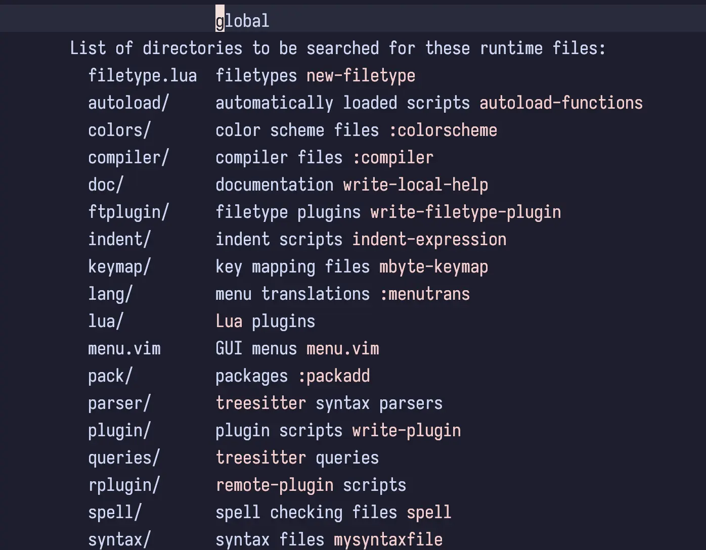

Neovim is a highly customizable and extensible text editor. And although wonderful, it can sometimes be a bit confusing or daunting for newcomers to start configuring.

Sure, there’s a lot of guides out there — but some people set up their config using the `lua/` directory, some don’t, some use `after/` , and some don’t, and some just stick to one big `init.lua` file. In short, a lot of people set up their config in different ways.

Boilerplate setups are great, and if you don’t care about any of this stuff it makes sense to just use someone else’s setup or follow a tutorial to get going. But if you want to understand what is happening behind the scenes when you set up Neovim, and how you can tailor it to your own preferences, I hope this guide proves useful to you.

The aim of this guide is to help you understand _how_ Neovim works, why you configure it in a certain way, and how you can get started tinkering with it. At the end of the day, people love Neovim because it’s customisable, and you can make it the exact way that _you_ want.

To this end, I hope to give you a base configuration and the confidence for you to change it or adjust it. So let’s get into it.

### Your first foray into configuration (the init.lua file)

Neovim, like a lot of other linux/unix programs, is configured through a user’s [dotfiles](https://www.freecodecamp.org/news/dotfiles-what-is-a-dot-file-and-how-to-create-it-in-mac-and-linux/).

These are files in your home directory which tell Neovim what keymaps you want to set, what settings Neovim should have, what plugins you want to use, and more. Every time you open up Neovim, it will look for these configuration files - one of the most important being the `init.lua` file.

The `init.lua` file is essentially the root for all of your configurations. Your custom settings, keybinds, plugins — if you wanted, you could throw all of them in here and call it a day. This is the file that Neovim looks for automatically on startup and will execute any and all code that you place inside of it.

Opening Neovim and typing `:h lua-guide` and scrolling to `lua-guide-config` has more information on it.


From the image above, follow its instructions and create the `~/.config/nvim` directory if you don’t already have one. It also says that this is where the `init.lua` file should be placed, which you can create by entering the Neovim configuration directory with cd `.config/nvim` followed by `touch init.lua`.

(also remember it’s probably not a good idea to run random commands from strangers on the internet :p).

To test whether you have set this up correctly, you can open the `init.lua` file and type `print("Hello World!")`. Remember this file and the code inside of it is ran automatically every time Neovim starts up.

You can save and quit the file with `:wq` , re-open it, and you should see “Hello, World!” at the bottom of your terminal.

_You could also use :luafile % to source the current buffer, but we’ll keep it simple for now._

The last part from the image above is particularly interesting:

> If you’d like to run any other Lua script on startup automatically, then you can simply put it in plugin/ in your ’runtimepath’.

It mentions being able to run any other script automatically by placing it in the `plugin/` directory.

So what is this directory? And what even is the runtimepath?

### A Brief Explanation of the runtimepath

Earlier on, I may have told a little white lie.

The `init.lua` file does indeed automatically run on Neovim startup, but it isn’t the only file which runs on startup. Neovim looks for a bunch of additional configuration files on something called the runtimepath.

The runtimepath is a group of directories that Neovim will search inside of when it starts up for these additional configuration files. They can be directories internal to Neovim, but can also be created by the user too.

Here’s part of what running `:h runtimepath` in Neovim opens:


The first image lists all of the parent directories included on the runtimepath. Most of these are internal to Neovim or not intended for user use, but it also includes the user’s config directory (`$XDG_CONFIG_HOME/nvim`) — hence why we can configure it.



The second image lists all of the files and folders that will be searched at runtime, from within those parent directories in the first image.

So in short, the runtimepath has a bunch of directories, and it will search inside them for a bunch more directories, which can contain files that are ran on Neovim start up.

You can test this if you like!

Create the directory `.config/nvim/plugin/`. Inside of it, create a `hello.lua` file and place it in the directory path given above. Write `print(“Hello from plugin!”)`, save the file, and re-load or source Neovim. As it’s on the runtimepath, It will run the code every time you open Neovim - just like the `init.lua` file.

It’s also worth noting that these directories can exist in multiple places, i.e. in Neovim internally and within your config directory. They won’t conflict, but it’s something to keep note of. Some plugins also make use of them internally in Neovim (or sometimes within your own config).

They might look appealing to you right now to set up your configuration - dedicated directories for your keymaps, color schemes, and plugins - and for some of it you would be right. But there’s another directory in that list which is also very important for configuration - the `lua/` directory.

Let’s have a look at the `lua/` directory, and start configuring some basic Neovim settings.

### The Lua Directory

Before we finally write some configuration code, I want to explain one final directory from the runtimepath above, which is the `lua/` directory.

If you’ve ever looked at other Neovim configurations or tutorials, this is the directory that you’ve probably seen the most. You can put most, if not all of your configuration here (bar your original `init.lua` file - this is still the entry point to your configuration). The `lua/` directory was made for custom scripts and Lua plugins, so you can run any valid Lua code in here - this includes all of your configuration if you really wanted to.

So let’s briefly look at the three ways you could configure Neovim right now:

- Put everything in the init.lua file ⭐️
- Use the dedicated runtimepath directories ⭐️⭐️
- Use the lua/ directory ⭐️⭐️⭐️

Or, if you really wanted, you could use some mixture of all of the above.

Out of all three, the majority of people set their configuration up using the `lua/` directory. This might seem counter-intuitive at first, but it’s the way I’d recommend to set up Neovim for reasons I will explain shortly. Once we start writing the configuration code though, feel free to experiment with the other ways to see what suits you best.

### Organization and Lua Modules

The reason you tend to see most users throwing their entire config in the `lua/` directory is because you can use [Lua modules](https://www.tutorialspoint.com/lua/lua_modules.htm) to organize your config in a nice, neat way. I won’t get too deep into how Lua modules work, but you can create sub-directories within the `lua/` directory for each part of your Neovim config. This won’t make too much sense yet, but it will when we start writing the config.

The ability to neatly organise all of the different sections of your configuration is why you tend to see a lot of configs being entirely in the `lua/` directory. And, as the Lua directory can have any kind of Lua scripts running in there, you can set it up in any way you like. Because of this, it can also be a source of confusion to newcomers. I know I was confused as to why everyone had completely different directory structures. It’s one of those things where you can choose how to organise your files so people end up having very different configs.

As you’ll probably want to be using Neovim with plugins, using the `lua/` directory is key as this is where the code for setting up your plugins and plugin manager will reside.

### Writing an Initial Configuration

Let’s start by creating some very simple settings that you might want for your Lua configuration:

```lua
local opt = vim.opt

opt.cursorline = true
opt.number = true
opt.relativenumber = true
opt.termguicolors = true
```

This creates a variable called `opt`, which maps the the global vim opt, and sets a cursorline, (relative) line numbers which are useful, and uses true colors for the terminal. If you’re wondering why I don’t have a lot of things set, Neovim has a lot of [sensible defaults](https://neovim.io/doc/user/vim_diff.html#nvim-defaults) meaning a lot of the typical settings you might need are set internally.

For the purposes of this tutorial, I will place this code in my `lua/` folder, in a file called `settings.lua`. Because it is technically a Lua module, you need to require it in your `init.lua` file. You can do this by simply adding `require("settings")` to the top of the `init.lua`.

Secondly, I want to set a very common keymap which sets the leader key in vim to the space key. This is just used essentially as an extra keyboard shortcut while inside Neovim, and you can use it with any plugins you install.

```lua
vim.g.mapleader = " "
```

Similarly, I will create a `keymaps.lua` file in my `lua/` directory and require it in my `init.lua`.

### Extending The Configuration, Plugins, and Conclusion

This is a nice, simple, configuration to get started and explains how and why you can use the `lua/` directory. But, as I said at the start of the post, this is about understanding the config and tailoring it to your own preferences.

You could place the keymaps into the `keymap/` directory. You could also just place all of the settings and keymaps code into your `init.lua` file and not even use the `lua/` directory at all. You have to do what works for you.

There’s nothing wrong with any of these ways to do it, but I’m a weirdo. I like to know why I’m setting something up in a certain way, and what the “best” way to do it is. So when I see multiple guides with multiple setups, it ends up making me want to re-write my config an unhealthy amount of times.

The truth though, which may be painful if you’re like me, is this:

There is no one way to setup Neovim. There are just different ways. Some are more efficient than others, but they all get the job done. Name things the way you want to name them, structure things the way you want to structure them, and evolve your configuration with time.

The next part of your Neovim setup is likely wanting to install plugins, which I have a separate post on. I hope that you at least found this post useful though in understanding the runtimepath and which files are automatically ran on startup, why people structure their `lua/` folders in different ways, and how you can begin structuring your configuration.

I hope you enjoyed!
