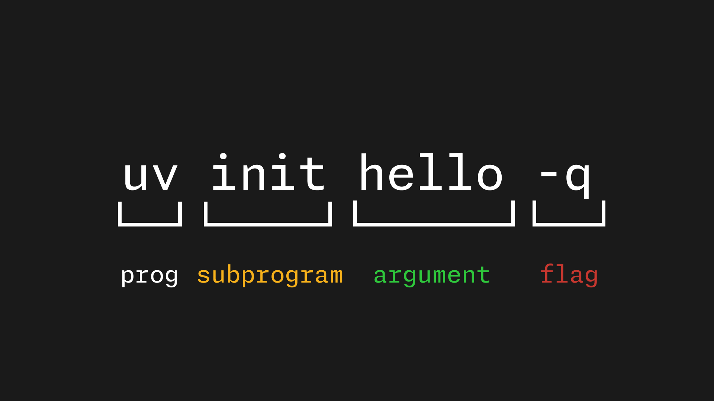
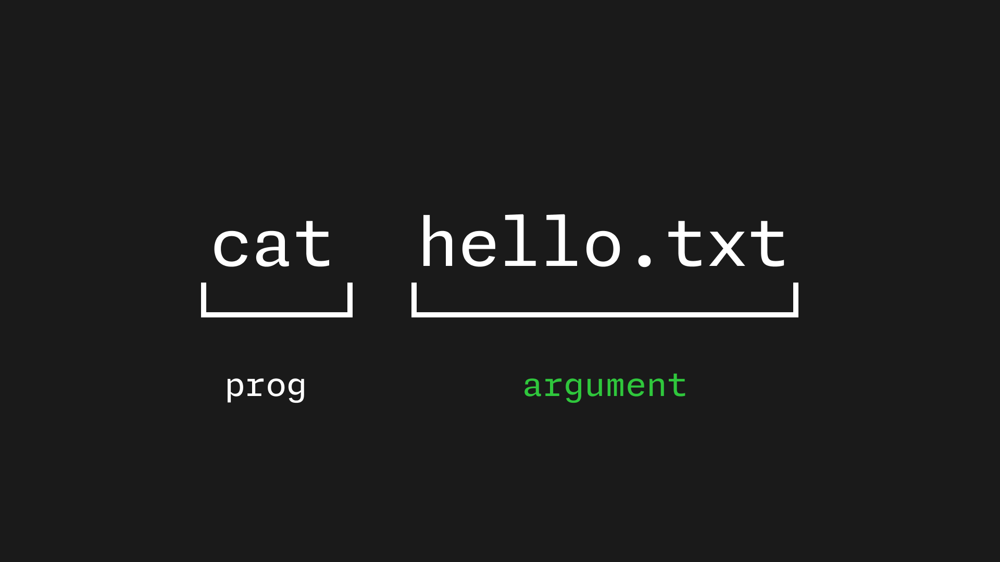
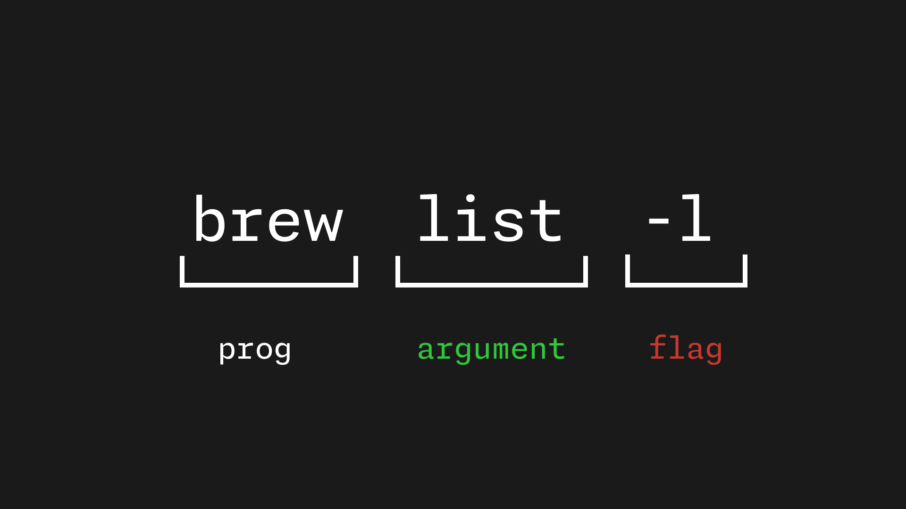
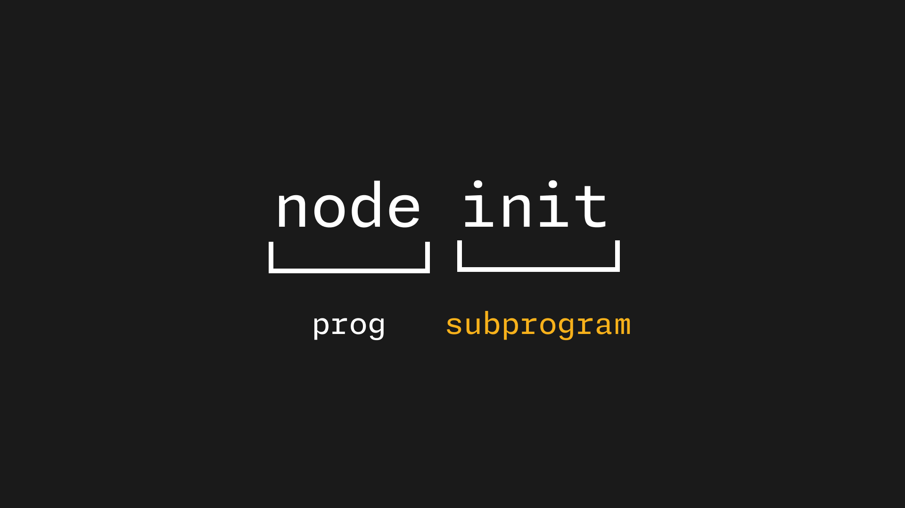

CLI tools are made up of three major parts:

- The main program itself
- Sub-programs
- Arguments
- Flags

In this post we'll go over each, and look at a few CLI tools as examples.

## The program

The program itself is fairly obvious: it's the name you use to invoke the program, for example `ls`. It is the main command which executes a program.

When you type the program's name, it is usually linked to an executable somewhere in your system (e.g. `bin`) which allows you to execute the code associated with this program.

This program can be followed by **sub-programs**, **arguments**, and **flags**.

## Arguments

Arguments are values that you, as a user, will pass into a CLI tool.

Think of these as values that can change.

For example, the program `cat` can take an argument of a file. This will make a command like `cat hello.txt`.

`cat` is the program name, and `hello.txt` is the **argument** of a file name. This argument is not fixed; i.e. you could also have done `cat notes.txt`, or `cat main.c`.

## Flags

Flags generally tend to modify the output or default behaviour of a CLI tool.

For example, I install packages on my system using Brew. I can list the packages I have installed with `brew list`, and I can add a flag (`-l`) to this command to change the default output into a "long" format.

You can run `brew list` vs `brew list -l` for yourself to see the difference.

Flags often begin with two dashes (`--`), with their short-form version starting with a single dash (`-`). This doesn't seem to be a hard and fast rule from what I can tell, but rather chops and changes depending on the design of each CLI tool itself.

## Subprograms

Subprograms are extra commands which aren't executed at the top level.

To give an example, running `vim` opens up Vim immediately; it doesn't have any subprogram you must run.

Some CLI tools might have extra programs. Take for example, Node.

Running `node` on its own doesn't really do too much - you typically pass in a subprogram for it to execute, such as `node init` to create a new project. These are examples of subprograms.

These can be combined with arguments and flags of their own to create more complex CLI tools.

## Conclusion

CLI tools tend to be quite straight-forward given their text format, but it's nice to actually nail down the different parts of the tool so you can pick up new ones more easily.

Once you know what exactly you're trying to do, you can often run `man [PROGRAM]`, or `[PROGRAM] help`, or something along those lines to get detailed information about how a CLI tool works.

I hope you found this post useful.

Thanks for reading!
