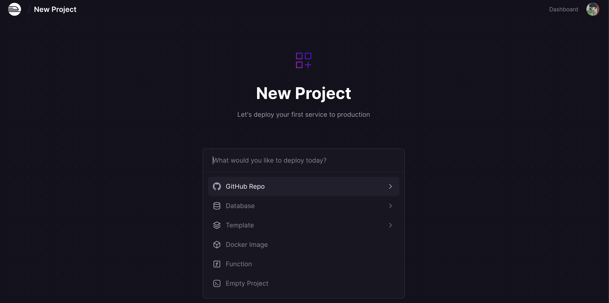
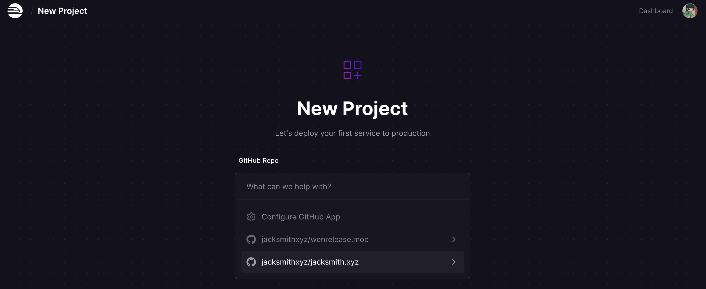
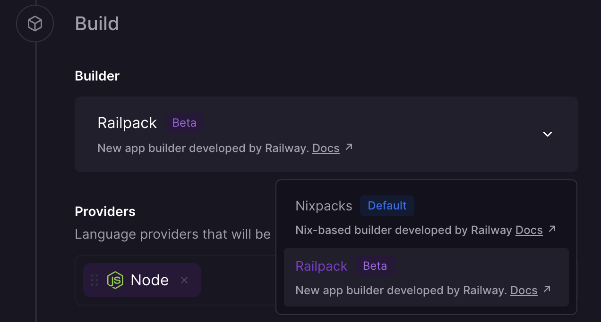
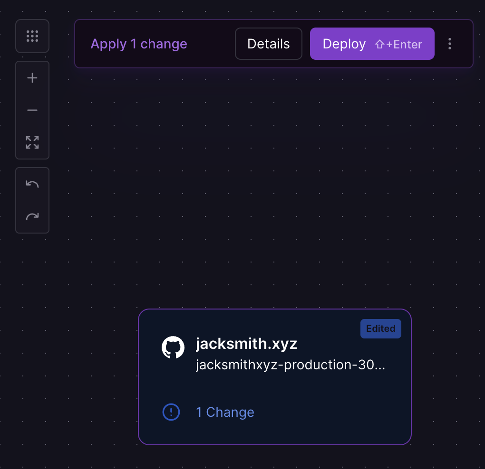
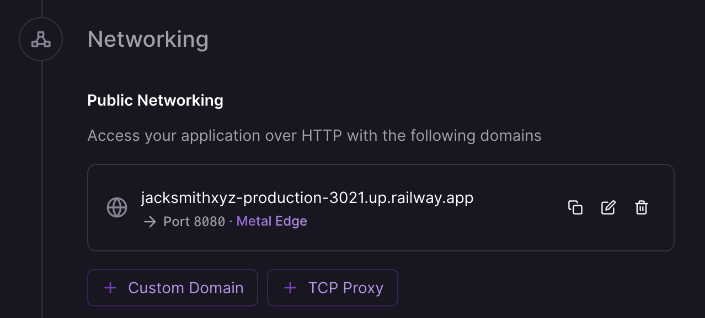

Hosting an Astro site on Railway is a pretty straight-forward experience, even without using any of Railway's community-provided templates.

In this post I'll explain how to get an Astro website hosted on Railway, with a domain, using the Railway web app. 

Quick disclaimers and shameless plug:

*I'm not sponsored by Railway, I just really like their product. My referral code is `jackxyz` if you do decide to sign up.*

### Prerequisites

- A Railway account
- An Astro website, hosted in a GitHub repository

### Starting a new Railway project 🚄

The first step is to create a new Railway project, and link it to the GitHub repository holding your Astro project.

From your dashboard, press the "New" button, and from the new project screen select GitHub repo. 

This will ask you to give Railway access to your GitHub repository if you haven't done so already. Obviously do so at your own risk, Railway is a third-party company, etc. 

After this you might need to refresh the page or wait a few seconds, and next time you select a GitHub repo you should be able to choose your project.

## Configuring your deployment

Select your project on the screen, and click on the "Settings" tab. 

From here, scroll down and switch fro Nixpacks to Railpack. 

**Why Railpack?**

Railpack is Railway's newer builder, and I've personally had less issues with it for deploying applications. But YMMV. 

Scroll up to the Networking tab, and click the "Generate Domain" button. For the port number, enter the default 8080 that Railway suggests. 

This might seem a little bit confusing considering Astro development builds listen on port 4321, but as Railway is handling all of the container management for us, it ends up serving our built website from port 8080. 

## Deploying your application

On the left-hand side of your screen where your project is, there should be a new popup to apply one change, and deploy your application. Click "Deploy", and your website will rebuild itself.

Once successfully deployed, you should be able to access your project at the domain generated in your settings:

## Updating your application

Simply push changes to your GitHub repository, and Railway will automatically redeploy your application. 

## Thanks for reading!

I hope you found this guide helpful.

If you'd prefer to create your project from a pre-configured template using Astro 5 and Tailwind 4, you can check out my template [here](https://railway.com/deploy/astro-tailwind-starter?referralCode=jackxyz&utm_medium=integration&utm_source=template&utm_campaign=generic). 