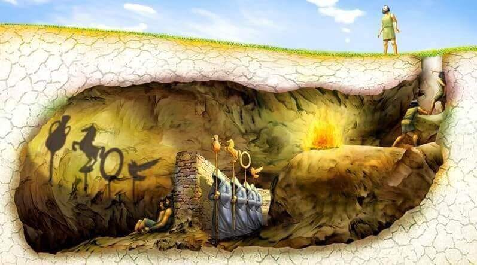
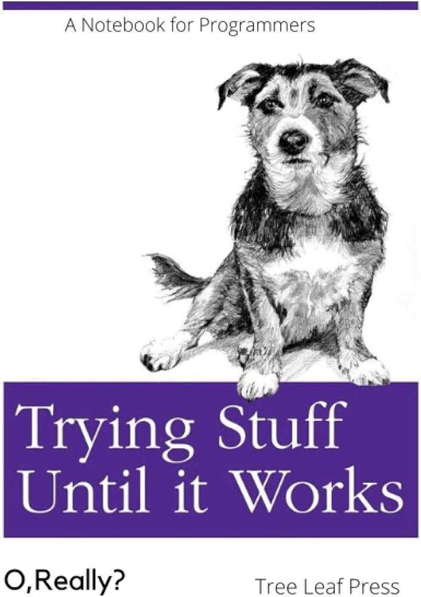

For the last few years or so, I've been working in the wonderful world of web development.

I don't mean this in a sarcastic manner either; the web is probably my favourite platform. No walled gardens - write HTML/CSS/JS, and push it to a server.

I've always enjoyed putting things on the screen, as well as working with data and doing backend shenanigans.

But what I don't enjoy about the state of modern frontend development is the sheer amount of convolutedness, and the large amount of glue engineering which I end up doing.

It feels like I spend half my time fixing package conflicts, trying to work out how to do *X* in *Y* framework, and connecting one API to another API. Some of this work can be fun, and it of course can actually serve the purpose of creating business value. There isn't any issue with it.

But I do ask myself: is this really what I want to do?

Do I want to be gluing different APIs together, and working out why this version of a package doesn't work with another one? Or learning a framework, which is essentially just a DSL, and have to re-learn the new spec every time it gets changed?

The answer is, of course, no. But the bigger problem is to do with **learning**.

The TLDR is that I like to learn new things. I want to do work where learning new things involves solving domain problems, or becoming a better programmer, rather than "learning" how a new framework functions. It feels like I'm not really learning anything real.

So, what to do?

## Insert learning PHP/Elixir/Ruby/other non-JS framework here

The logical step might be to seek out a different style of web programming - one that at least isn't as heavily reliant on JavaScript/TypeScript (on the backend, at least).

Some of the domain problems will likely remain the same, but that's maybe okay. But they also limit me I think to a specific domain, and don't feel very different.

So, I've decided on one programming language and ecosystem in particular to explore.

## Venturing into something new: Rust

Maybe this will age like milk, but my opinion is that I think Rust is likely going to be one of the biggest programming languages of the next era.

It ticks a lot of my boxes, in the sense:
- It's a nerdsnipe with lots of new concepts to learn
- It has a rapidly maturing ecosystem
- It has a strong presence in the web ecosystem (backend frameworks, WASM, etc)
- It leaves room for growth and opportunities to build other things (e.g. developer tooling)

I could explore systems programming or other similar areas, and I'm an avid enjoyer of unix and the command line.

But the keyword here is **user**. I have a lot of respect for systems programmers and whatnot, but I think for me I've always been more focused on building things for users, developers, etc.

## Conclusion and final thoughts

Really I want to do good work, build interesting and cool software, write about it, and use any combination of these skills to make it as an indie. This is a lot to ask for, I'm aware, but hey, you gotta try and do things.

Thanks for reading!
